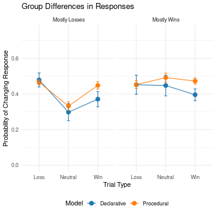
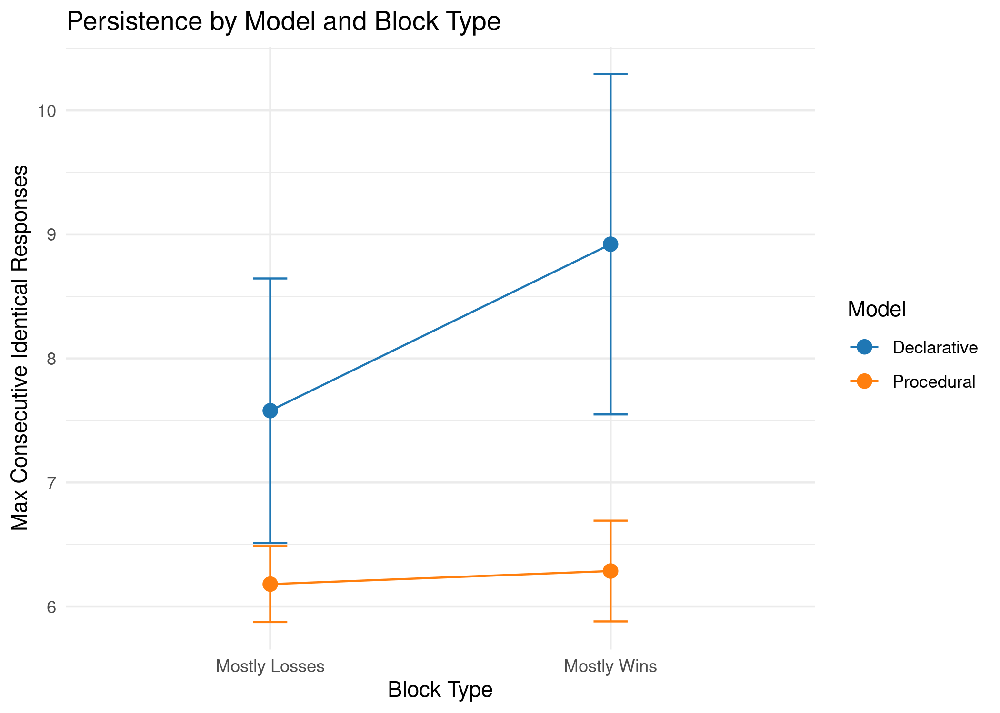
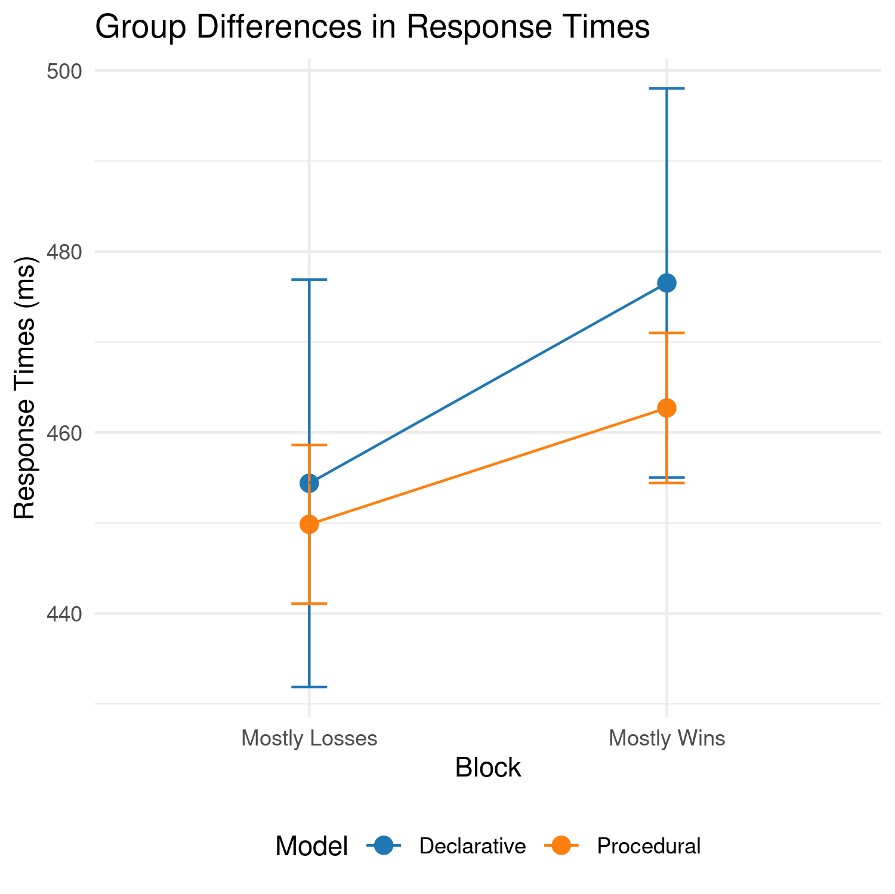

This is the complete analysis of Cher's [project](https://www.biorxiv.org/content/10.1101/2023.01.10.523458v1.abstract), but extended to all the trials in the dataset and  using a Python reimplementation of the Declarative and Procedural subsystems in ACT-R.

In the new analysis, individuals best-fit by the Declarative model show significant behavioral differences when compared to individuals best-fit by the Procedural model.  These differences are apparent in:

1. The probability of changing response from trial to trial

 

2. The maximum number of consecutive identical responses

3. The associated response times
  

