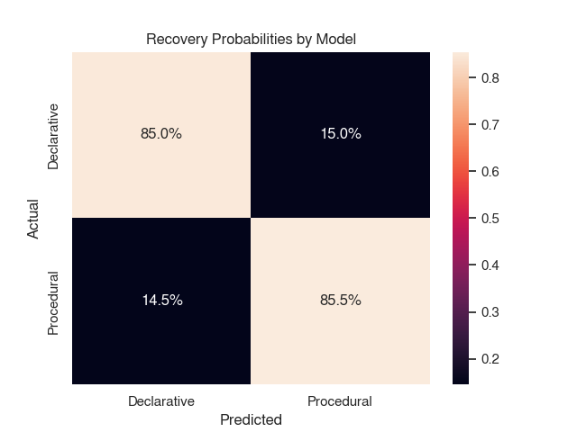
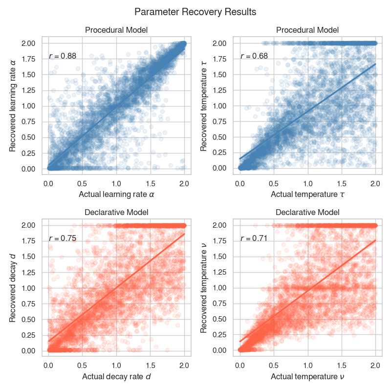

# Analysis 3

This is the complete analysis of Cher's [project](https://www.biorxiv.org/content/10.1101/2023.01.10.523458v1.abstract), but extended to all the trials in the dataset and  using a Python reimplementation of the Declarative and Procedural subsystems in ACT-R.

## Results

In the new analysis, individuals best-fit by the Declarative model show significant behavioral differences when compared to individuals best-fit by the Procedural model. 

In the model assignment procedure, both model recovery and parameter recovery are highly reliable:

Here is the confusion matix for model recovery:

And the correlation values for parameter recovery:

 

