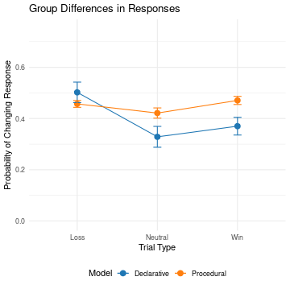
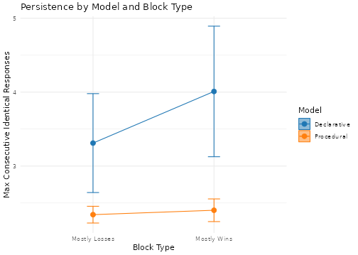
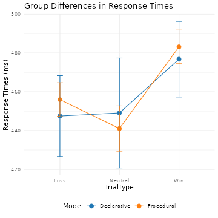

# Behavioral Results

In the new analysis, individuals best-fit by the Declarative model show significant behavioral differences when compared to individuals best-fit by the Procedural model.  These differences are apparent in both behaviroal and task fMRI data.

## Behavioral Differences

Procedural and Declarative participants differ in:

1. The probability of changing response from trial to trial

 

2. The maximum number of consecutive identical responses

We found no difference in:

3. The associated response times

  
