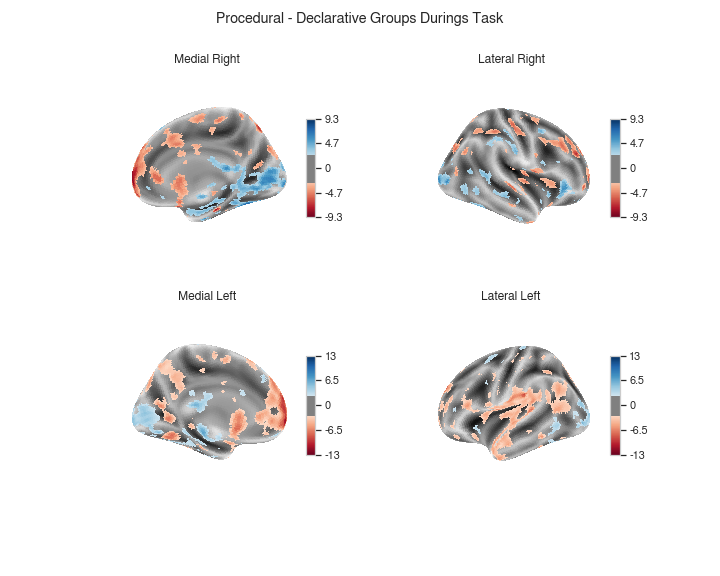

# Task fMRI Results

Procedural and Declarative participants differentially engage different brain areas. In teh figure below, red indicates greater brain activity in participants best fit by the _declarative_ model, and blue greater brain activity in participants fit by the _procedural_ model.

  

